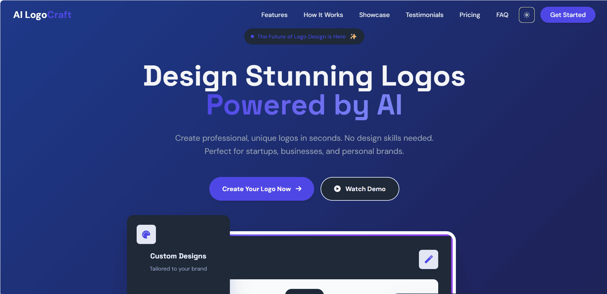
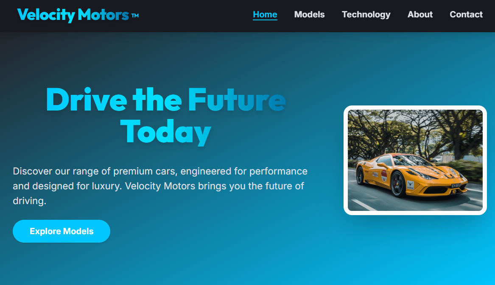
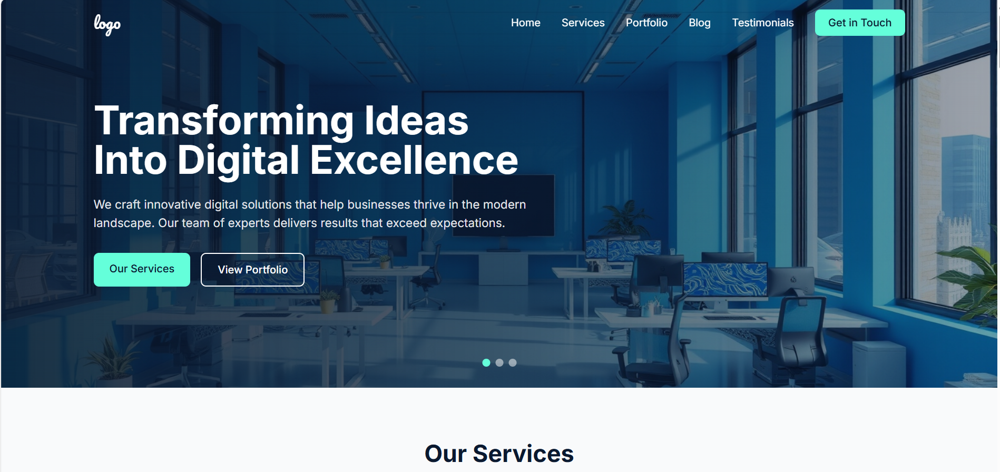

# Landing Portfolio Projects

This repository contains a collection of modern, responsive landing page templates for various business types. Each template is designed with a clean, professional aesthetic and includes all necessary sections for an effective online presence.

## Projects

### 1. LogoCraft AI
A modern landing page template for an AI-powered logo generation service, featuring both light and dark modes.

    

        
        
Light Mode

    

    

        
        
Dark Mode

    

**Template Features:**
- Dark and light mode support
- Responsive design for all devices
- Showcase section for logo examples
- Feature highlights section
- Testimonials section
- Pricing plans section
- Contact form

---

### 2. Velocity Motors (Automotive)
A premium automotive landing page template featuring sleek design and modern UI components.

**Features:**
- Dark mode design with gradient accents
- Vehicle showcase gallery
- Responsive layout for all devices
- Contact form integration
- Modern, clean UI components

---

### 2. Leaf & Plate (Restaurant)
An elegant restaurant landing page with warm, inviting design elements.

**Features:**
- Beautiful food gallery
- Online reservation system
- Menu display with categories
- Customer testimonials
- Responsive design

---

### 3. TradeStat Pro (Software)
A professional SaaS landing page for financial trading software.

**Features:**
- Clean, professional interface
- Feature showcase section
- Pricing tables
- Dashboard preview
- Testimonials and trust indicators

---

### 4. GlobalSource (Corporate)
A professional corporate website template for businesses and services.

**Features:**
- Business-oriented design
- Service showcase
- Team member profiles
- Contact information
- Clean, professional layout

---

### 5. Web Agency
A creative template for web design and digital agencies.

**Features:**
- Portfolio showcase
- Service offerings
- Client testimonials
- Contact form
- Modern, creative design

## Getting Started

1. Clone the repository
2. Navigate to any project folder
3. Open `index.html` in your web browser

## Customization

Each template can be customized by:
- Modifying the HTML structure
- Updating the CSS in the respective style files
- Adding your own images to the images folder
- Updating the content to match your business needs

## Browser Support

All templates are designed to work in modern browsers including:
- Chrome (latest)
- Firefox (latest)
- Safari (latest)
- Edge (latest)

## License

These templates are available for personal and commercial use.
